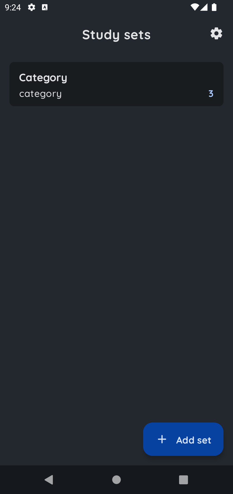
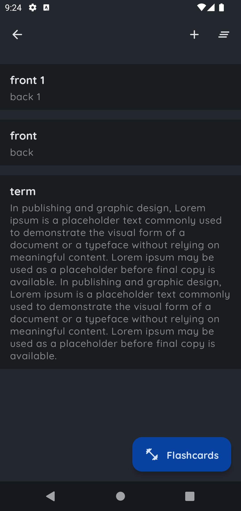
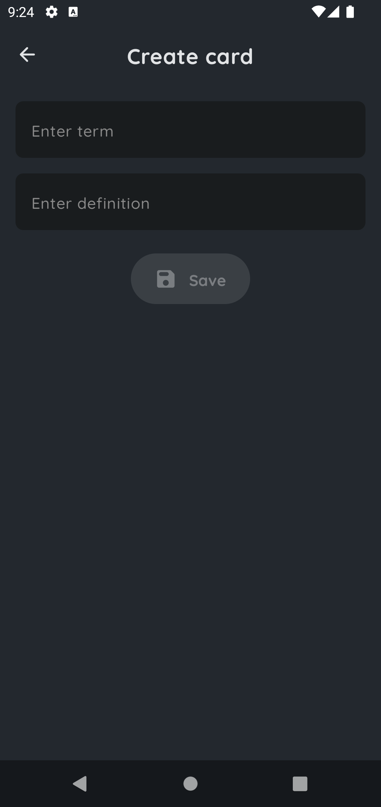
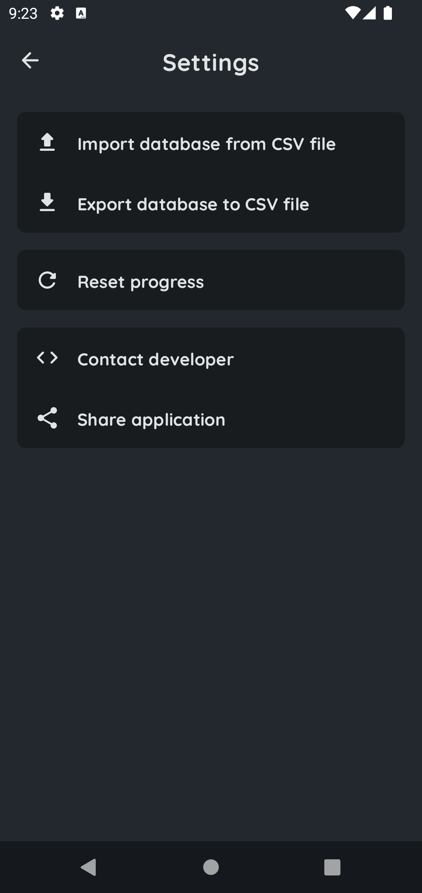

# **Simple Vocabulary**

Flashcards on repeat. Study modes on shuffle. Create sets anywhere life takes you with the mobile
app.

This project is developed by **Javokhir Savriev** for more
projects [GitHub](https://github.com/javokhirsavriev/) .

## Application Install

***You can Install and test latest Simple Vocabulary app from below 👇***

## About

    

 

    
    
      
    
    

### This sample app showcases the following:

* Clean and Simple UI with Jetpack Compose
* Best and Clean Code Quality following Modern Android Development
* MVI Architecture (ViewModel + MutableState + StateFlow)
* Dagger Hilt for DI
* Compose Navigation
* Compose Dialog

## 📸 Screens

|   |   |   |
|---|---|---|
||  | 
| | 

## Status: 🚧 In progress

Simple Vocabulary is still under development and more screens will be added.

## Built With 🛠

- [Jetpack Compose](https://developer.android.com/jetpack/compose) - Jetpack Compose is Android’s modern toolkit for building native UI. It simplifies and accelerates UI development on Android. Quickly bring your app to life with less code, powerful tools, and intuitive Kotlin APIs.
- [Kotlin](https://kotlinlang.org/) - First class and official programming language for Android development.
- [Coroutines](https://kotlinlang.org/docs/reference/coroutines-overview.html) - For asynchronous and more..
- [Flow](https://kotlin.github.io/kotlinx.coroutines/kotlinx-coroutines-core/kotlinx.coroutines.flow/-flow/) - A cold asynchronous data stream that sequentially emits values and completes normally or with an exception.
- [StateFlow](https://developer.android.com/kotlin/flow/stateflow-and-sharedflow) - StateFlow is a state-holder observable flow that emits the current and new state updates to its collectors.
- [Android Architecture Components](https://developer.android.com/topic/libraries/architecture) - Collection of libraries that help you design robust, testable, and maintainable apps.
    - [ViewModel](https://developer.android.com/topic/libraries/architecture/viewmodel) - Stores UI-related data that isn't destroyed on UI changes.
- [Dependency Injection](https://developer.android.com/training/dependency-injection) -
    - [Hilt-Dagger](https://dagger.dev/hilt/) - Standard library to incorporate Dagger dependency injection into an Android application.
    - [Hilt-ViewModel](https://developer.android.com/training/dependency-injection/hilt-jetpack) - DI for injecting `ViewModel`.
- [Room](https://developer.android.com/jetpack/androidx/releases/room) - an abstraction layer over SQLite to allow for more robust database access while harnessing the full power of SQLite.
- [Material 3](https://m3.material.io/) - Make personal devices feel personal with Material Design 3, Google's most expressive and adaptable design system yet.
- [Compose Navigation](https://developer.android.com/jetpack/compose/navigation) - The Navigation component provides support for Jetpack Compose applications. You can navigate between composables while taking advantage of the Navigation component’s infrastructure and features.
- [Coil](https://coil-kt.github.io/coil/compose/) - An image loading library for Android backed by Kotlin Coroutines.

## If you like my projects you can buy me a cup of coffee

## Contact

You can connect with me here [LinkedIn](https://www.linkedin.com/in/sjavokhir/)